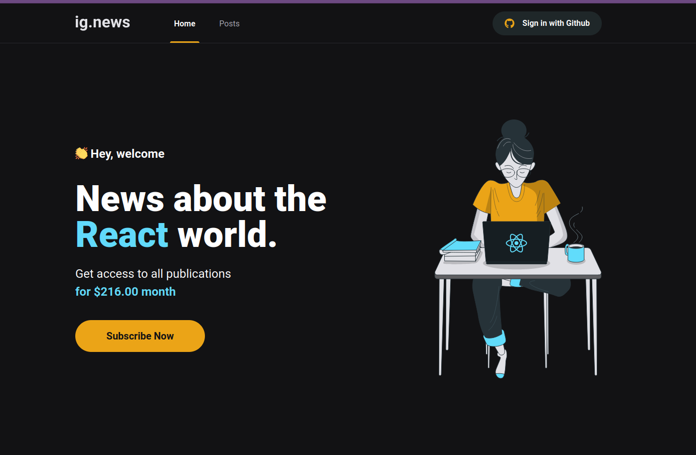
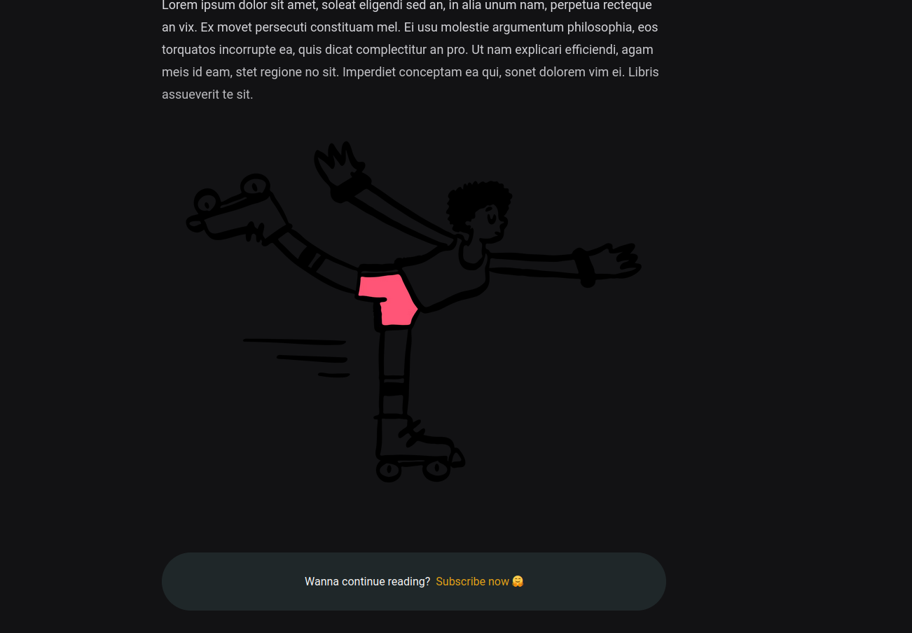
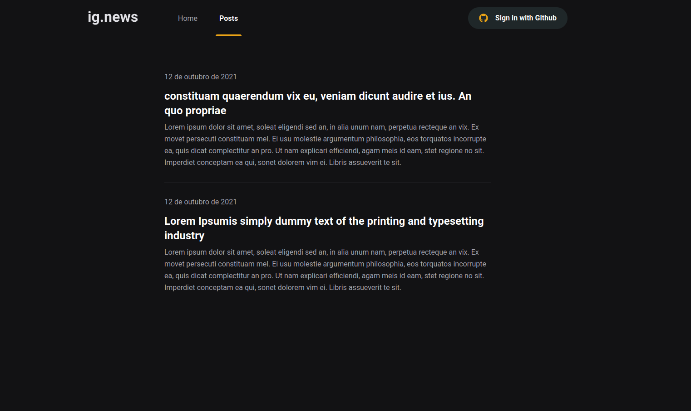

<p align="center">
   
   
   
</p>

---

# :pushpin: Table of Contents

- [Features](#rocket-features)
- [Build with](#construction_worker-BuildWith)
- [Installation](#construction_worker-installation)
- [License](#closed_book-license)

# :rocket: Features

- SSR.
- SSG.
- STRIPE WEBHOOKS.
- GITHUB AUTH.

# :construction_worker: BuildWith

- [NextJS](https://nextjs.org/)
- [Next Auth](https://next-auth.js.org/)
- [Stripe](https://stripe.com/)
- [SASS](https://sass-lang.com/)
- [Prismic CMS](https://prismic.io/)
- [FaunaDB](https://fauna.com/)
- [Typescript](https://www.typescriptlang.org/)

# :construction_worker: Installation

**You need to install [Node.js](https://nodejs.org/en/download/) and [Yarn](https://yarnpkg.com/) (or use npm instead yarn), then in order to clone the project via HTTPS, run this command:**

```bash
git clone https://github.com/Rafaelb4rros/ignews.git
```

```bash
# Install dependencies
yarn install
```

Get your keys and change the
<strong>.env.example</strong>
to .env.local

```bash
yarn dev
```

# :closed_book: License

Released in 2022
This project is under a license [MIT](./LICENSE).

Made with 💜 by [Rafael Barros](https://github.com/Rafaelb4rros) 🚀
